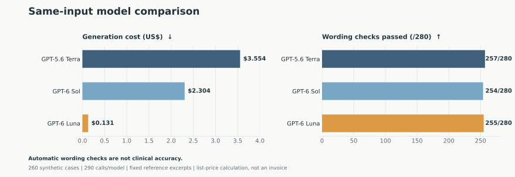
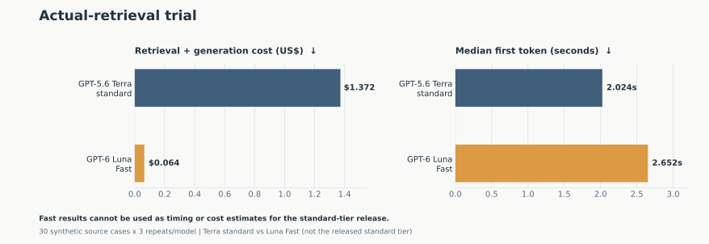

# [2026-09-24] v3.0.0 versión mayor — De la calculadora del Sumario Estructural al asistente de IA

[한국어](./README.md) | [English](./README.en.md) | [日本語](./README.ja.md) | [Español](./README.es.md) | [Português (Brasil)](./README.pt-BR.md)

Publicamos Exner v3.0.0 en [exner.app](https://exner.app). A la calculadora del Sumario Estructural existente se añadieron cuentas, asistentes conversacionales de codificación e interpretación, y suscripción. La interfaz y el material de referencia están disponibles en coreano, inglés, japonés, español y portugués brasileño. El examinador puede conversar libremente con la IA, pero las sugerencias de la IA no sustituyen el proceso de verificar la respuesta original y el registro de la fase de encuesta. La codificación y la interpretación finales corresponden al profesional clínico.

## Qué cambió en esta versión

Después de registrarse con una cuenta de Google y dar un consentimiento separado para enviar información a la IA, puede utilizar el asistente de codificación y el asistente de interpretación. Ambos asistentes responden con **GPT-6 Luna, nivel de razonamiento `medium` y nivel de servicio estándar**. Buscan el material de referencia necesario para la pregunta y, cuando la conversación se alarga, resumen el contenido anterior y lo transmiten a las preguntas posteriores. Si la información es insuficiente, pueden preguntar qué debe verificarse en lugar de ofrecer un código o una interpretación definitivos. Ni el resumen ni las respuestas modifican las respuestas introducidas ni los resultados verificados por la calculadora.

La suscripción cuesta **US$3.99** al mes y **US$42.99** al año. El uso de IA se administra mediante un límite mensual de costo de procesamiento, no por número de preguntas, y la aplicación muestra la cantidad restante. El importe real cobrado en wones coreanos y los impuestos dependen de la pantalla de pago y de las condiciones de la tarjeta. El consentimiento para enviar información a la IA es independiente de la suscripción y puede retirarse.

### ¿Debo recalcular los registros anteriores?

Este lanzamiento no modifica las fórmulas del Sumario Estructural de v2 ni los resultados de cálculo ya completados. **No es necesario recalcular los registros de v2 solo por el lanzamiento de v3.** Cuando utilice en una evaluación real un código o una explicación sugeridos por la IA, debe contrastarlos de nuevo con la respuesta original, la fase de encuesta y el conjunto de los datos clínicos.

## ¿Por qué elegimos GPT-6 Luna?

No fijamos desde el principio el modelo más barato. Primero tomamos como referencia las respuestas de **GPT-5.6 Terra**, el modelo que usábamos hasta entonces. Esta prueba interna de referencia de 26 preguntas fue distinta de la comparación más amplia que publicamos después. Probamos 26 preguntas representativas en los cinco idiomas y completamos 32 llamadas; el costo calculado según el uso fue de aproximadamente **US$0.40**. La prueba automática de redacción aprobó inicialmente 25/31, pero tras corregir los casos en los que la respuesta tenía el sentido correcto y el verificador no reconocía una redacción distinta, y volver a verificar las respuestas guardadas, el resultado fue 29/31. Por esta experiencia, tampoco llamamos directamente «tasa de acierto clínico» a las cifras posteriores.

A continuación construimos **260 preguntas sintéticas** en total, 143 de codificación y 117 de interpretación, distribuidas en 61 en coreano, 64 en inglés, 47 en japonés, 44 en español y 44 en portugués. Además de preguntas normales, incluimos solicitudes fuera del alcance admitido, instrucciones insertadas en los documentos, preguntas de seguimiento y resúmenes de conversaciones largas. Proporcionamos a GPT-5.6 Terra, GPT-6 Sol y GPT-6 Luna las mismas instrucciones del producto y los mismos extractos de referencia, y realizamos 290 llamadas por modelo, incluidos los resúmenes. Los extractos de esta etapa diferían de la búsqueda por pregunta de la aplicación real.

| Modelo | Prueba automática de redacción (recalificada) | Costo de generación calculado para 290 llamadas | Latencia mediana por llamada |
| --- | ---: | ---: | ---: |
| GPT-5.6 Terra | 257/280 | US$3.553828 | 3.061 s |
| GPT-6 Sol | 254/280 | US$2.304015 | 3.125 s |
| GPT-6 Luna | 255/280 | US$0.130514 | 3.357 s |

En esta tabla, el costo de generación de Luna fue **un 96.3% más bajo** que el de Terra, y el número de aprobados en la prueba automática de redacción fue similar. Sin embargo, 255/280 no puede leerse como «255 respuestas clínicamente correctas». Después de revisar las respuestas, corrigimos el tratamiento de negaciones, notación numérica y sinónimos del verificador y recalificamos **únicamente las respuestas ya guardadas**. También hubo casos en los que la evidencia necesaria no estaba desde el principio en los extractos de referencia y el modelo, con prudencia, se abstuvo de emitir un juicio. Los costos de búsqueda, servidor y pagos tampoco figuran en esta tabla. Publicamos las cifras por idioma y el método de prueba en el [registro de la comparación inicial](../../benchmarks/2026-09-23/).

### ¿Por qué probamos Jev y por qué lo excluimos de la ruta de lanzamiento?

La codificación implica muchos juicios que reducen los candidatos según criterios definidos. Por eso probamos un esquema en el que **TypeSafe Jev, especializado en juicios estructurados, evalúa primero la suficiencia de la información, el alcance de la solicitud y la pertinencia de las fuentes, y GPT explica al examinador**. Dispusimos que la respuesta original y los resultados de cálculo no se sobrescribieran con el juicio de Jev. El objetivo no era añadir por sí misma una etapa de juicio más barata, sino comprobar **si se reducía el costo total de una respuesta útil manteniendo la calidad de la explicación**.

Primero, en 30 preguntas de Jev sobre el determinante M, las 30 respuestas válidas coincidieron con los valores esperados provisionales del autor. No se trata de una clave de respuestas confirmada por profesionales clínicos. Las solicitudes agrupadas en grupos de 10 tuvieron éxito, pero dos solicitudes que agrupaban 30 a la vez devolvieron HTTP 503, y no pudimos determinar si la causa estaba en el servicio intermediario o en el modelo de origen. No utilizamos el importe facturado de **US$0** de la promoción de Vercel AI Gateway vigente en ese momento como costo operativo a largo plazo.

A continuación comparamos en paralelo GPT-6 Sol y Luna solos frente a su combinación con Jev, en 10 preguntas de ajuste en los cinco idiomas y en 20 preguntas de otro grupo de reglas. En la prueba automática de redacción de las 10 preguntas de ajuste, Luna solo y Sol solo obtuvieron **9/10** cada uno, y Jev+Luna y Jev+Sol obtuvieron **8/10** cada uno. En 20 preguntas reservadas del ajuste, pero incluidas en el conjunto anterior de 260, Luna solo obtuvo **17/20**, Sol solo **15/20** y las dos configuraciones combinadas **19/20** cada una. Las cifras más altas de este último grupo no eran evidencia de superioridad clínica. Hubo casos, como el cálculo de Cn, en los que la respuesta del modelo solo también era correcta pero el verificador no reconoció la redacción, y en una pregunta sobre DV en coreano las cuatro configuraciones no lograron recuperar la regla necesaria y se abstuvieron de juzgar. En la lectura por IA de las 80 respuestas guardadas no se detectaron errores graves, pero **no se trata de una revisión clínica independiente y tampoco se confirmó una ventaja semántica de la combinación.**

El costo supuesto con precio unitario directo de los 10 casos de Jev+Luna, **US$0.010538**, fue mayor que el de Luna solo, **US$0.008627**. En los 20 casos separados también fue así: **US$0.017494** frente a **US$0.011021**. Ambos son *valores supuestos* que aplican a los tokens el precio unitario directo público de Jev, y excluyen el costo de los fallos. Tampoco se había preparado una cuenta directa real de TypeSafe, y los errores y costos de algunas solicitudes a Jev no se verificaron hasta el final. En estas condiciones, conectar Jev al servicio oficial solo podía añadir complejidad sin demostrar ahorro ni mejora de calidad. Por lo tanto, **v3.0.0 no utiliza Jev.** Dejamos también el [detalle por solicitud de Jev solo y combinado](../../benchmarks/2026-09-23/) junto con los fallos.

### Volvimos a comprobar si Luna también puede responder en la aplicación real

En lugar de los extractos fijos de la prueba inicial, añadimos una prueba que, como la aplicación real, busca el material de referencia pertinente para cada pregunta. Al comparar de forma cruzada 1 caso de codificación y uno de interpretación en cada uno de los cinco idiomas con GPT-5.6 Terra y GPT-6 Luna en nivel estándar, ambos modelos obtuvieron **10/10** según el criterio automático. El costo calculado de los 10 casos, sumando búsqueda y generación, fue de **US$0.226730** para Terra y **US$0.011580** para Luna. La mediana del tiempo hasta el primer texto de Luna fue de **7.314 s**, mayor que los **2.392 s** de Terra. No ocultamos la diferencia de velocidad mirando solo el costo.

También comparamos la variante más rápida, Luna **Fast**. Midiendo solo la generación, la mediana hasta el primer texto fue de **5.582 s** en estándar y **2.994 s** en Fast, pero el costo de generación correspondiente aumentó de **US$0.010000 → US$0.035559**. Existe también un resultado, en una comparación de 30 casos originales × 3 repeticiones con búsqueda real, en el que el costo calculado de Luna Fast fue un 95.33% más bajo que el de Terra, pero la mediana hasta el primer carácter aumentó de 2.024 a 2.652 s. En la revisión por IA de Claude de la primera repetición, Terra tuvo 0/30 respuestas por debajo de 80 puntos y Luna Fast 4/30. **Ese resultado corresponde a la prueba de Fast y no describe la velocidad ni el costo del nivel estándar de Luna publicado.** Priorizamos el costo y el contenido de las respuestas y lanzamos con el nivel estándar.

También releímos las 280 respuestas guardadas y los 10 resúmenes de Luna. La lectura interna por IA de las 280 respuestas dio **217 normales, 35 seguras pero incompletas, 15 falsos positivos de la prueba automática, 12 abstenciones por evidencia insuficiente y 1 atribución de fuente levemente errónea**. La primera lectura, en la que faltaba el resumen previo en la entrada de revisión o la codificación de caracteres estaba dañada, no se usó como evidencia y se volvió a verificar. La revisión por IA separada de Claude Fable 5.1 también pasó por alto un error real de fuente. Por lo tanto, no aprobamos clínicamente ninguna respuesta por el mero hecho de que las IA coincidieran.

Ajustamos, de una en una, las instrucciones, la búsqueda y el resumen, centrándonos en la explicación de un número bajo de respuestas, la redacción propia de cada idioma, el material de referencia ausente, las correcciones del usuario y el historial de retractación de juicios anteriores. No trasladamos tal cual a los cinco idiomas las frases que mejoraron en coreano, sino que volvimos a comparar en cada idioma. En una respuesta española sobre un número bajo de respuestas, la puntuación mínima de la revisión por IA subió de 76 a 82 puntos tras la corrección, pero revertimos las modificaciones sin efecto en otros idiomas. En los resúmenes en inglés y portugués observamos omisiones del historial de retractación; tras ajustar eso, aún faltaban algunas preguntas no resueltas, y en respuestas de seguimiento en coreano también observamos casos con mezcla de otro sistema de escritura. En el [registro de verificación posterior](../../benchmarks/2026-09-24/) anotamos las pruebas por idioma, los costos, los cambios revertidos y los problemas pendientes.

## Costos de prueba publicados y cómo leerlos

El costo de generación calculado para las 870 llamadas iniciales, 290 por cada uno de los tres modelos GPT, es de **US$5.988357**. Es la suma de los tres importes de la tabla anterior. El importe facturado de Jev bajo la promoción gratuita de entonces no es un precio unitario a largo plazo, y en la tabla de combinación del [registro de la comparación inicial](../../benchmarks/2026-09-23/) anotamos por separado una *estimación* con el precio unitario directo de TypeSafe. Posteriormente, el importe calculado según el uso de OpenAI para los 26 lotes de ejecuciones guardadas relacionadas con Luna es de **US$2.369002**, y la conversión al precio de lista mostrado por la CLI de Claude es de **US$117.300407**. No sumamos estas dos cifras como cargo real a la tarjeta. Las comparaciones anteriores, los costos no registrados, las solicitudes fallidas y los costos operativos de servidor y pagos no están incluidos en esos 26 lotes. En el [inventario de costos desidentificado](../../benchmarks/2026-09-24/luna-cost-inventory.json) indicamos el alcance incluido.

La prueba automática de redacción, la lectura de respuestas por IA y la revisión real por profesionales clínicos son cosas distintas. En particular, la puntuación de mejora en preguntas ya examinadas durante el desarrollo no garantiza la misma calidad con datos de pacientes nuevos o preguntas nuevas. No completamos una evaluación en la que el nivel estándar de Luna seleccionado supere dos veces casos independientes nuevos en los cinco idiomas y en todas las tareas. Además de las respuestas que se abstienen por falta de información, las respuestas que se abstienen en exceso cuando podrían responder siguen siendo objeto de mejora.

En el sitio de producción comprobamos con cuentas sintéticas las respuestas de los asistentes de codificación e interpretación y la creación de la pantalla de pago Live. Tampoco se completó la revisión clínica independiente. Corregiremos los defectos que se detecten según los registros de transacciones y la evidencia original, y seguiremos documentando la calidad de las respuestas y los costos en versiones posteriores.

Las Condiciones de uso y la Política de privacidad entran en vigor el **2026-09-24**. El código fuente y las instrucciones de IA de v3 se publicarán empezando por las partes en las que ya se revisaron los secretos, los registros clínicos y los derechos sobre material de terceros. Estas notas de la versión y los informes de referencia no significan que se haya completado la publicación de todo el código de producción.

El [registro de modelos y revisión](../../benchmarks/MODEL-PROVENANCE.md) indica los nombres exactos de los modelos, los niveles de razonamiento y de servicio verificados, sus funciones y las configuraciones que no quedaron registradas. OpenAI Codex redactó el original coreano y lo cotejó con las pruebas; Claude Fable 5.1 preparó los borradores en los otros cuatro idiomas e hizo una revisión editorial y factual independiente con IA. No presentamos esa revisión como evaluación de especialistas clínicos.
